# Mass Email Sending using AWS S3, Lambda, and SES

Sending mass emails using AWS services like S3 (Simple Storage Service), Lambda, and SES (Simple Email Service) can be an efficient way to send bulk emails to a large number of recipients. This README provides step-by-step instructions on how to set up and configure these services for mass email distribution.

## Prerequisites
Before you begin, you'll need the following:

1. **An AWS account:** Make sure you have an AWS account. If you don't have one, you can create it at AWS Console.


2. **Email Addresses**: Ensure you have a list of email addresses to which you want to send mass emails.

## Step 1: Set up an S3 Bucket
1. Open the AWS S3 Console.
2.  **Create a New S3 Bucket:**
If you need to create a new S3 bucket to store your email content, follow these steps:

* In the AWS S3 Console, click the "Create bucket" button.

* Enter a unique and descriptive name for your S3 bucket. Bucket names must be globally unique.

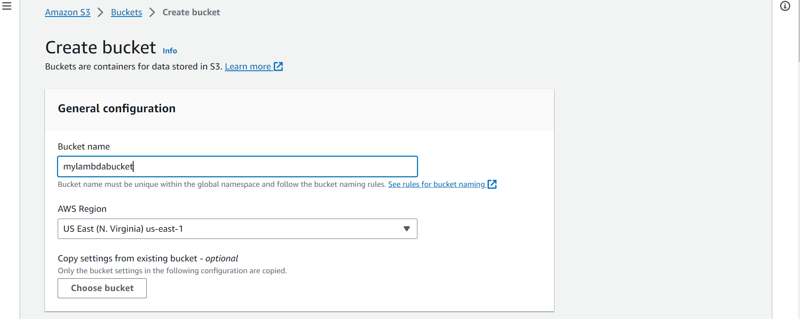

* Select the AWS Region where you want to create the S3 bucket. Choose the region closest to your target audience or where your other AWS services are located.

* Click "Next."

* Choose the default settings for the "Configure options" section or adjust them as needed. You can configure settings like versioning, logging, and tags. Then click "Next."

* Review the settings in the "Review" section and click "Create bucket."
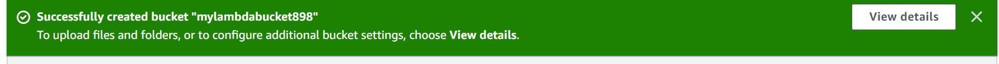
## Step 2: Create an AWS Lambda Function
1. Open the AWS Lambda Console:

Open the AWS Lambda Console.

2. **Click "Create function":**

* In the Lambda Console, click the "Create function" button.

3. **Choose an Authoring Method:**

You'll be prompted to choose an authoring method. Select one of the following:
* "Author from scratch" if you want to create a custom function.
* "Use a blueprint" if you want to start with a predefined blueprint or template.
* "Browse serverless app repository" if you want to use a pre-built serverless application.
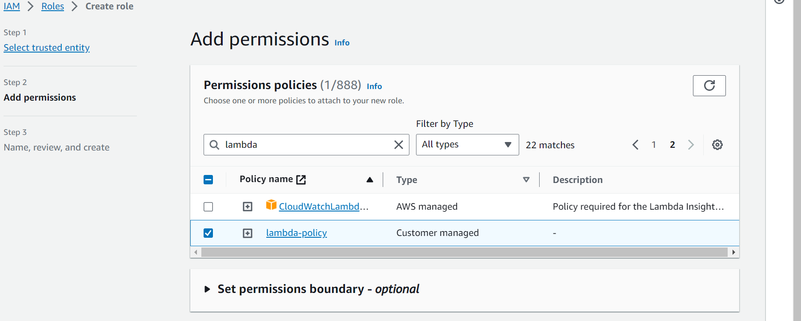
4. **Configure Basic Information:**

* Provide a name for your Lambda function.
* Choose a runtime (e.g., Python, Node.js, Java, etc.).
* Select an existing execution role or create a new one with the necessary permissions (e.g., S3 access, SES access, CloudWatch logs).
* You can create a new role from the Lambda function configuration page.

5. **Advanced Settings (Optional):**

* You can configure additional settings such as function memory, timeout, VPC (Virtual Private Cloud), and environment variables based on your requirements.
6. **Click "Create function":**

* After configuring the basic settings and any advanced settings, click the "Create function" button.

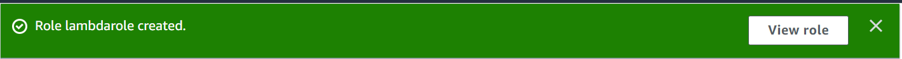

Your AWS Lambda function is now created and ready for further configuration.


## Step 3: Configure Event Notifications

1. **Open the AWS S3 Console:**

   Open the [AWS S3 Console](https://console.aws.amazon.com/s3/).

2. **Select Your S3 Bucket:**

   From the list of S3 buckets on the main page, select the S3 bucket from which you want to trigger events.

3. **Navigate to the "Properties" Tab:**

   * After selecting the S3 bucket, click on the "Properties" tab in the top menu.

4. **Create Event Notification:**

   * Scroll down to the "Events" section, which is where you can configure event notifications for this S3 bucket.

   * Click on "Create event notification" to set up a new event notification.

5. **Name Your Event Notification:**

   * In the "Name" field, give your event notification a descriptive name. This name will help you identify and manage the event notification.
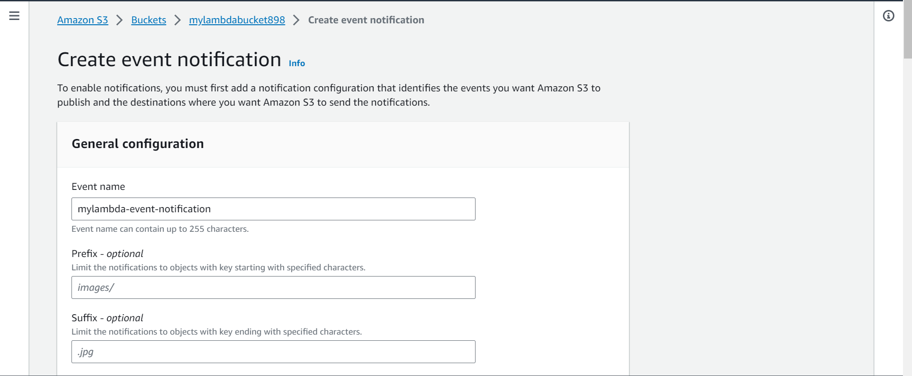
6. **Choose Event Type:**

   * In the "Event types" section, select the event type that will trigger your Lambda function. For mass mailing purposes, you can choose "All object create events" to trigger the Lambda function whenever a new object is added to the bucket.

   * Optionally, you can specify filters using the "Prefix" and "Suffix" fields. These filters allow you to trigger the event only for objects with specific names or extensions. For example, if you want to trigger the event only for files with a ".html" extension, you can set the "Suffix" to ".html."

7. **Add Destination (Lambda Function):**

   * In the "Send to" section, choose "Lambda function" as the destination for the event.

   * Click on "Add Lambda function" to select the Lambda function you want to link to this event notification. You can search for and select the Lambda function you've created in the previous steps.

8. **Save the Event Notification:**

   * After configuring the event notification settings, click "Save" to confirm and activate the event notification.

Your S3 bucket is now configured to trigger your Lambda function when the specified events occur, such as when new objects are added to the bucket.

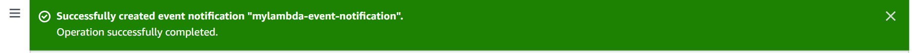

To create an IAM policy that can be attached to an IAM role and subsequently associated with an AWS Lambda function, follow these steps:

## Step 4: Attach an IAM Role to the Lambda Function
 ### Create an IAM Policy

1. **Open the AWS IAM Console:**

   Open the [AWS IAM Console](https://console.aws.amazon.com/iam/).

2. **Navigate to Policies:**

   - In the IAM Console, click on "Policies" in the left-hand navigation pane.

3. **Create Policy:**

   - Click the "Create policy" button to start creating a new policy.
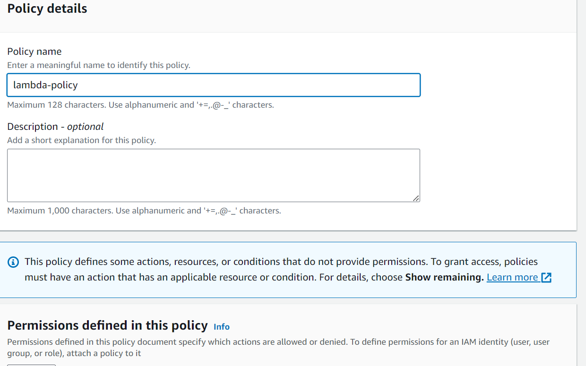
4. **Choose a Policy Type:**

   - In the "Create Policy" wizard, you can choose between "JSON" and "Visual editor." We'll use the "JSON" tab for creating a policy.

5. **Edit the Policy Document (JSON):**

   - In the JSON tab, you can write or paste the JSON policy document. This document defines the permissions for your policy.

6. **Review and Create:**

   - Review your policy document to ensure it provides the necessary permissions for your Lambda function.

   - Click "Next: Tags" if you want to add tags to your policy. Otherwise, click "Next: Review."

7. **Provide Policy Details:**

   - Give your policy a name and description.

8. **Create Policy:**

   - Click "Create policy" to finalize the policy creation.
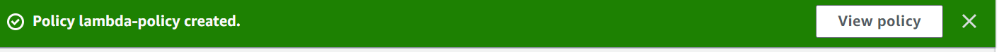
### Create an IAM Role

After creating the policy, the next step is to create an IAM role to which you can attach this policy. The IAM role will be associated with your Lambda function.

1. In the AWS IAM Console, click on "Roles" in the left-hand navigation pane.

2. Click the "Create role" button.

3. Choose the service that will use this role. Select "Lambda" as the use case.


4. Click "Next: Permissions."

5. Search for and select the policy you created in Step 1. Then, click "Next: Tags."

6. (Optional) Add tags to your IAM role if needed. Otherwise, click "Next: Review."

7. Provide a name and description for the IAM role.

8. Click "Create role."


### Attach the Role to Your Lambda Function

Now that you have an IAM role, you can attach it to your Lambda function:

1. Open the AWS Lambda Console.

2. Select your Lambda function.

3. In the "Configuration" tab, under "Permissions," click on the "Execution role" hyperlink.

4. In the "Execution role" section, click "Edit."

5. Choose "Use an existing role" and select the IAM role you created in Step 2.

6. Click "Save" to apply the role to your Lambda function.

Your Lambda function now has the necessary permissions provided by the IAM policy associated with the IAM role. It can access and interact with the specified AWS services based on the permissions defined in the policy.


To create an S3 event trigger for your Lambda function, follow these steps:

## Step 5: Create an S3 Event Trigger

1. **Open the AWS Lambda Console:**

   Open the [AWS Lambda Console](https://console.aws.amazon.com/lambda/).

2. **Select Your Lambda Function:**

   From the list of Lambda functions in the Lambda Console, select the Lambda function that you want to configure the S3 event trigger for.

3. **Scroll Down to "Add triggers" Section:**

   In the Lambda function's configuration page, scroll down to the "Add triggers" section.

4. **Click on "Add trigger":**

   - Click the "Add trigger" button to set up a new trigger for your Lambda function.

5. **Configure the S3 Event Trigger:**

   - In the "Trigger configuration" panel, follow these steps:
     - Choose "S3" as the trigger type.

     - In the "Bucket" dropdown, select the S3 bucket where you've uploaded your email content. This is the bucket that will trigger your Lambda function.

     - In the "Event type" dropdown, select "All object create events" if you want to trigger the Lambda function whenever a new object is created in the S3 bucket. Alternatively, you can choose a specific event type that suits your use case.
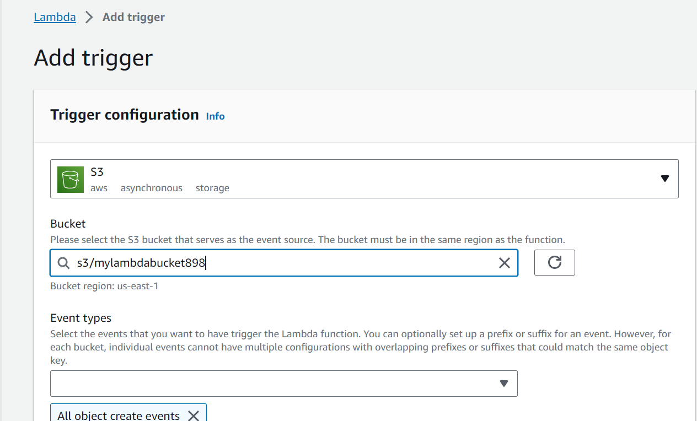
     - Optionally, you can use the "Prefix" and "Suffix" fields to specify filters. These filters allow you to trigger the Lambda function only for specific object names or extensions. For example, if you want to trigger it only for files with a ".html" extension, set the "Suffix" to ".html."

   - After configuring the S3 event trigger settings, click "Add" to create the trigger.
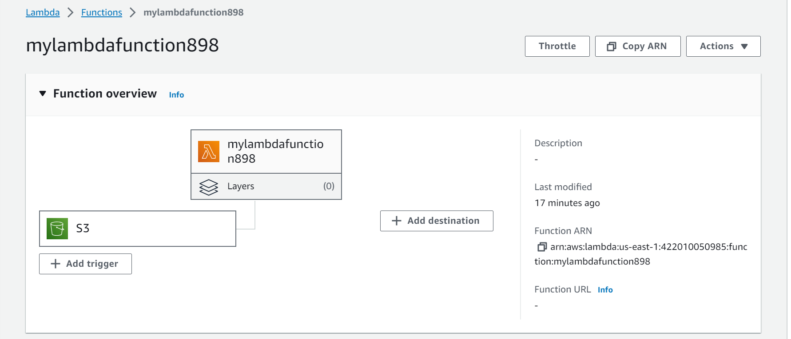
The S3 event trigger is now configured for your Lambda function. When new objects that match the defined criteria are added to the specified S3 bucket, your Lambda function will be automatically triggered to perform the desired mass mailing tasks using Amazon SES or other email services.


## Step 6: Configure AWS SES (Simple Email Service)

1. **Open the AWS SES Console:**

   - Open the [AWS SES Console](https://console.aws.amazon.com/ses/).

2. **Verify the Sender Email Address or Domain:**

   - In the SES Console, the first step is to verify the sender email address or domain that you will use to send emails. This is a crucial step to avoid email delivery issues. Follow the SES Console's verification process to ensure your sender identity is verified.

3. **Set Up AWS SES Configuration:**

   - Configure your AWS SES settings, which may include:
     - Email sending limits.
     - Handling of bounces and complaints.
     - Configuring email templates (if needed).
     - Enabling email feedback forwarding (if needed).
     - Configuring your email sending domain (e.g., DKIM settings).


   
   - Make sure your AWS SES configuration aligns with your email sending requirements and follows AWS SES best practices.


Your AWS SES configuration is now set up, and AWS SES is ready to handle your email sending requirements. SES is a powerful service that helps you send emails at scale while ensuring high deliverability and managing bounces and complaints. Make sure your configuration aligns with your mass mailing needs.


## Step 7: Configure the Lambda Function to Process S3 Events

1. **Back in the Lambda Function Configuration:**

   - Return to the Lambda function configuration by going to the AWS Lambda Console and selecting your Lambda function.

2. **Scroll Down to the Function Code Section:**

   - In the Lambda function configuration, scroll down to the "Function code" section.


3. **Add Logic to Process S3 Events:**

   - In the Lambda code, you can add logic to process the S3 events triggered by the S3 bucket. For example, you can extract the email content from the S3 object, compose and send emails using SES (Simple Email Service), or perform any other desired actions.

   - Below is an example of a Python Lambda function that sends emails when triggered by S3 events. You can modify and expand this code to suit your specific use case:

   ```python
   import boto3
   import json

   ses_client = boto3.client('ses', region_name='us-east-1')

   def lambda_handler(event, context):
       # Process S3 event data (e.g., retrieve the S3 object and send emails)
       for record in event['Records']:
           bucket = record['s3']['bucket']['name']
           key = record['s3']['object']['key']

           # Add your email sending logic here
           # You can use the content from the S3 object to compose and send emails using SES.

       return {
           'statusCode': 200,
           'body': json.dumps('Emails sent successfully.')
       }
   ```

   - In the code above, `boto3` is used to create an SES client. The `lambda_handler` function processes S3 event data, retrieves the S3 object details, and performs email sending logic. You can customize the email sending logic to match your use case.
   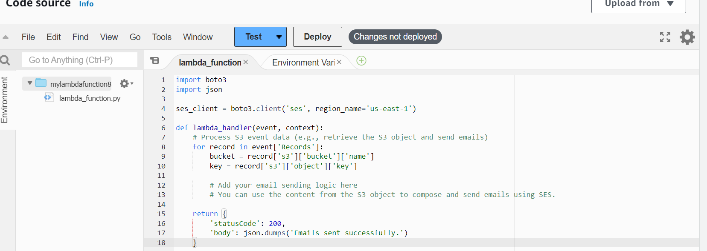

4. **Save the Lambda Function Configuration:**

   - After adding the necessary logic to process S3 events, scroll to the top or bottom of the Lambda function configuration page and click "Save" to save the changes.

Your Lambda function is now configured to process S3 events. When new objects are created in the specified S3 bucket, your Lambda function will be triggered to execute the defined logic, such as sending emails, using the content from the S3 objects.


## Step : Test the Setup

1. **Upload an Email Content File:**

   - To test your setup, upload an email content file to your S3 bucket. Ensure that the S3 object's name and extensions match the triggers you've configured. For example, if you set the "Suffix" filter to ".html," make sure you upload a file with the ".html" extension.

2. **Monitor Lambda Function Execution:**

   - Once you've uploaded the file, monitor the Lambda function's execution to verify that it processes the S3 events and sends emails as intended.

   - You can check the Lambda function's execution status and logs in the AWS Lambda Console to ensure that it's triggered by the S3 event and performs the email sending logic as expected.
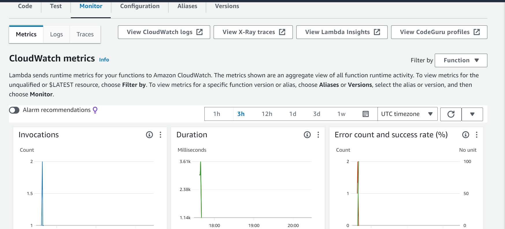
3. **Testing Best Practices:**

   - It's a good practice to start with a small test to ensure everything works as expected. Upload a single email content file, trigger the Lambda function, and verify that the email is sent successfully.

   - Once you confirm the test is successful, you can scale up and upload more email content files to your S3 bucket to send emails at scale.

By following these steps, you've set up an event notification on your S3 bucket to trigger a Lambda function, allowing you to process email content and send emails when new objects are added to the bucket. Testing your setup helps ensure that your mass mailing system is functioning as intended.